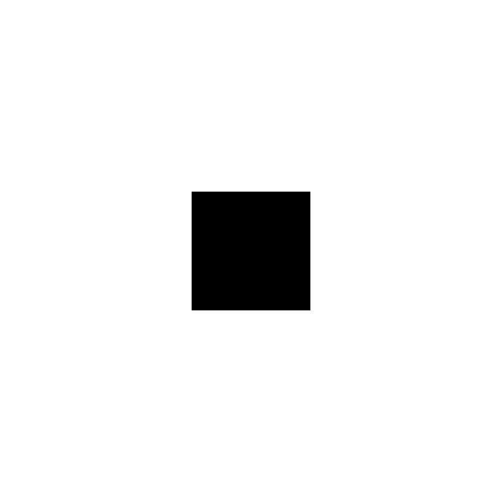
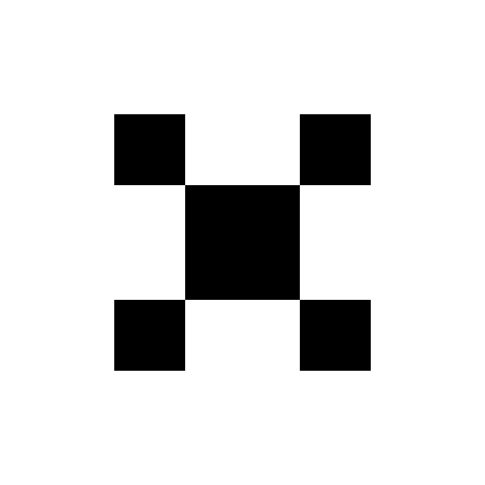

# fibCarpet
Automated generation of **Fibonacci carpet peseudofractals**, a concept created by [Nathan Grimes](http://nathangrimesfineart.com/).

Grimes was drawing these Fibonacci carpets by hand in Paint, pixel by pixel. The center square is some square whose side length is some Fibonacci number `F(n)`:

Each successive set of squares is drawn adject to the previous square's corners, and their side length is Fibonacci number `F(n-1)`:

This process is iterated on each square with uncovered corners until you reach a square of length 1, at which point you have run out of space to place any more squares.

I figured that I could automate this tedium. In my presentation of the idea I animated the process by which my code generated the carpets. The code is quick, dirty, WET, and slow. But it worked.

Example output from the code is included in the [fibCarpet13](/fibcarpet13) folder.
